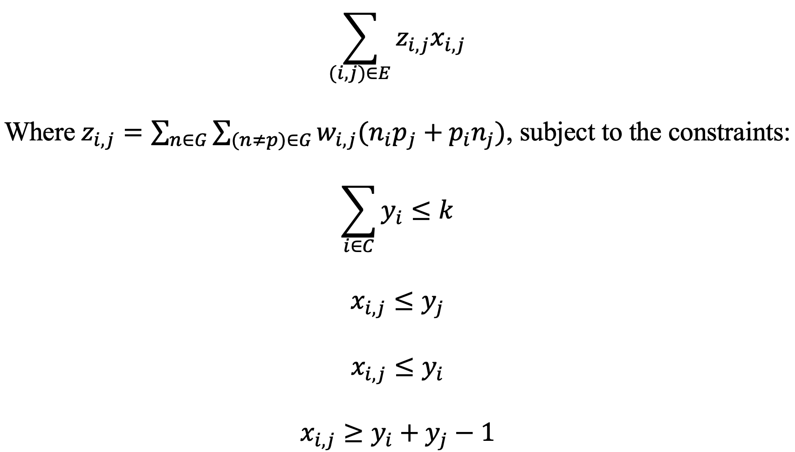

# MoToCC
Module to Critical Cell-types (MoToCC) is a linear programming approach to identify cells that selectively express a set of genes of interest, such as the genes belonging to a genetic module (**Figure 1**). 

<p align="center">  <br>  </p> 
<b>Figure 1. </b> Given single-cell or single-nucleus gene expression data, cell-cell similarity and K-nearest neighbor connectivity derived from the expression data, module genes, and an upper bound to the number of cells to return as a solution (<i>k</i>), MoToCC first calculates edge weights among module genes as per Equation 1, then uses linear programming to find an initial solution consisting of approximately <i>k</i> cells. The initial solution of candidate cells is refined by identifying cells in the largest strongly connected component (LSCC) and returning the set of candidate cells in the LSCC as the solution. <br>


<br> MoToCC maximizes an objective function defined as the product of the correlated co-expression of module genes and cell-cell similarity while subject to linear constraints (**Figure 2**).

<p align="center">  <br>  </p> 
<b>Figure 2.</b> Single cells can be represented as a graph with edges (<i>i, j</i>) in <i>E</i>, in which an edge weight between two cells <i>i</i> and <i>j</i> is the weighted pairwise autocorrelation <i>z<sub>i,j</sub></i>. The indicator variable <i>x<sub>i,j</sub></i> describes whether an edge is selected between cells, and the indicator variables <i>y<sub>i</sub></i> and <i>y<sub>j</sub></i> describe if a cell <i>i</i> or <i>j</i> is selected. For genes <i>g</i> from gene <i>n</i> to gene <i>p</i> in a module <i>G</i>, the normalized expression of a gene for a particular cell is noted as <i>n<sub>i</sub></i>, <i>n<sub>j</sub></i>, <i>p<sub>i</sub></i>, and <i>p<sub>j</sub></i>. Cell-cell similarity is represented as <i>w<sub>i,j</sub></i>. The parameter <i>k</i> is the upper bound for the number of cells that selectively express module genes to return as a solution.

# How to run MoToCC
Python packages needed to run MoToCC are listed [here](https://github.com/jchow32/MoToCC/blob/824ce5fea996c5560cb0597de86aebee781e6a04/pre_post_processing/conda_python_list.txt). <br>

  Required parameters: <br>
  - -e $expression <normalized expression data (.hdf5)>
    - The expression file contains normalized and scaled single-cell expression data (cells x genes)
    - [compress_inputs.py](https://github.com/jchow32/MoToCC/blob/0de0a1847938c37b0bc05222196ef1c54067bd07/pre_post_processing/compress_inputs.py) compresses expression data 
  - -sim $similarity <cell-cell similarity derived from expression data (.npz)>
    - Cell-cell similarity (cells x cells) can be retrieved as the shared-nearest neighbor (SNN) graph via example scripts for [brain](https://github.com/jchow32/MoToCC/blob/0de0a1847938c37b0bc05222196ef1c54067bd07/pre_post_processing/exp_processing_brain.R) and [kidney](https://github.com/jchow32/MoToCC/blob/0de0a1847938c37b0bc05222196ef1c54067bd07/pre_post_processing/exp_processing_kidney.R) datasets
    - The script [compress_inputs.py](https://github.com/jchow32/MoToCC/blob/0de0a1847938c37b0bc05222196ef1c54067bd07/pre_post_processing/compress_inputs.py) saves cell-cell similarity as a sparse matrix
  - -knn $knn <K-nearest neighbor connectivity derived from expression data (.npz)>
    - K-nearest neighbor (KNN) connectivity can be retrieved via example scripts for [brain](https://github.com/jchow32/MoToCC/blob/0de0a1847938c37b0bc05222196ef1c54067bd07/pre_post_processing/exp_processing_brain.R) and [kidney](https://github.com/jchow32/MoToCC/blob/0de0a1847938c37b0bc05222196ef1c54067bd07/pre_post_processing/exp_processing_kidney.R) datasets
    - [compress_inputs.py](https://github.com/jchow32/MoToCC/blob/0de0a1847938c37b0bc05222196ef1c54067bd07/pre_post_processing/compress_inputs.py) saves the KNN graph as a sparse matrix (cells x cells)
  - -m $module <genes of interest>
    - Text file consisting of module genes (new-line delimited)
  - -c $cell_ids <cell ids from expression data>
    - Text file containing all cell ids in the **same** order as in $expression (new-line delimited)
    - Example commands to retrieve cell_ids from expression data are available [here](https://github.com/jchow32/MoToCC/blob/ba53860abde0455ee59c31807e91dc137e6e0211/pre_post_processing/MoToCC_log.sh)
  - -g $gene_ids <gene ids from expression data>
    - Text file containing all gene ids in the **same** order as in $expression (new-line delimited)
    - Example commands to retrieve gene_ids from expression data are available [here](https://github.com/jchow32/MoToCC/blob/ba53860abde0455ee59c31807e91dc137e6e0211/pre_post_processing/MoToCC_log.sh)
  - -k $k <upper bound of cells to return as solution>
    - Integer
  - -o $output_string <output string to contain in output file names>
    - Output files will contain this string in their file names
  
  <br>Optional flags:<br>
  - --quickstart <enables quickstart>
    - Quickstart should be disabled the first time a module is provided to MoToCC (see Tips)
  - --prune <enables pruning>
    - Pruning reduces the number of edge weights by setting edge weights with weight outside of one standard deviation of the mean edge weight to 0
  - --integer <enables integer programming>
    - By default, linear programming is enabled when this flag is disabled
    
Example command with quickstart disabled: 
```
python3 C_TULPSE.py \
-e $expression  \
-sim $similarity  \
-knn $knn \
-m $module \
-c $cell_ids \
-g $gene_ids \
-k $k \
-o $output_string
```

# Tips
* The parameter _k_ can be varied for any given module to select cells at varying degrees of resolution. A silhouette score describing the similiarty of selected cells following two-dimensional t-SNE reduction is automatically printed as output by MoToCC.
* Percent composition of selected cells can be calculated via [get_comp.py](https://github.com/jchow32/MoToCC/blob/ba53860abde0455ee59c31807e91dc137e6e0211/pre_post_processing/get_comp.py) if cell-type labels are known.
* After running MoToCC for a given module for the first time (without the --quickstart flag), edge weights associated with the module are automatically saved. If the user wishes to provide multiple, unique values of _k_ to MoToCC, enabling the quickstart option allows MoToCC to read the saved edge weights and reduce runtime on subsequent runs.
* Example pre- and post-processing scripts are available for the compression of expression data, percent composition calculation, and visualization of selected cells via dimensionality reduction plots [here](https://github.com/jchow32/MoToCC/tree/main/pre_post_processing). 
